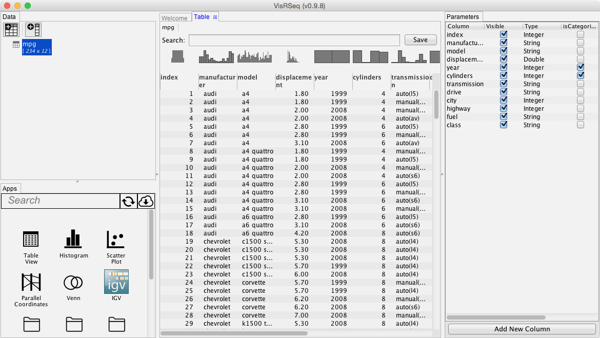
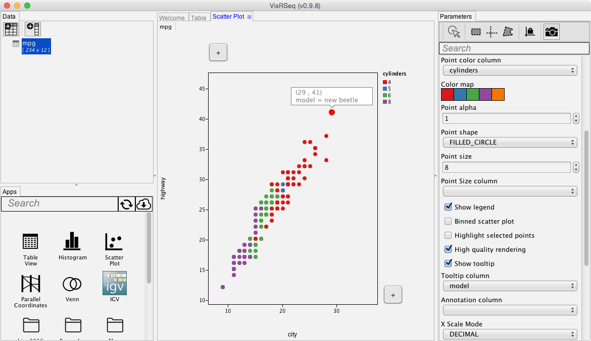

# Materials for the Beijing summer school workshop (2016)


## Software Requirements
Download the latest version of VisRseq from [visrseq.github.io](http://visrseq.github.io). Follow the installation requirements.

## Quick Tutorial
  * Download the small test data from [data/mpg.txt](data/mpg.txt)
  * Run VisRseq
  * Click on the toolbar button with the table icon (top left) and select [Open Table]
  * Open the mpg.txt file
  * Drag-n-Drop the [Table View] or [Scatter Plot] app from the Apps pane (bottom left) to the workspace.
  * Drag-n-Drop the mpg data from the data pane into the app window.
  * Change the app parameters using the Parameter pane (right)

  



## Questions and Issues
Please use the [issue page](https://github.com/hyounesy/beijing2016/issues) to ask questions or report issues.

## Assignment
You will be using / extending VisRseq for visual analysis of a movie dataset which can be downloaded from [data/movies.txt](data/movies.txt). The data is a slightly modified version of the movie dataset downloaded from [Rdatasets](http://vincentarelbundock.github.io/Rdatasets/datasets.html). You can also find more information about the fields in the movie dataset [here](https://vincentarelbundock.github.io/Rdatasets/doc/ggplot2/movies.html).

There are two categories for this assignment: (1) Data Analysis, (2) App development / improvement. You may participate in either or both categories.

### (1) Data Analysis
You will be using VisRseq to create an [infographic](https://en.wikipedia.org/wiki/Infographic) about the movie dataset. 

  * The submission will be in the form of a single page PDF document or PNG image. 
  * All plots in the infographic should be generated within the VisRseq framework, but you may use other software (e.g. MS Word, MS Powerpoint, Photoshop, etc.) to arrange several plots and to add additional text or graphics.
  * The submissions will be evaluated based on: 
    * the amount of information content
    * clarity (i.e. ease of interpretation)
    * interesting findings
    * aesthetics (i.e. artistic look)

### (2) App Development / Improvement
For this category, you can choose to develop a new R-App or modify and improve an existing R-App. This can specially be interesting for those who would like a coding challenge and/or are familiar with R.
A detailed tutorial on how to create apps for VisRseq framework can be found [here](https://github.com/hyounesy/bioc2016.visrseq).
The goal is to enhance the current analytical power of VisRseq to allow getting more or improved results. App(s) may add new computational functionality (e.g. new classification method) or new plots. It is still in the context of movie dataset, but the app should be designed such that it can be used with any tabular data.

  * The submission should include the ```.R``` and ```.json``` files for the new or improved app. 
  * App(s) should be functional in the current VisRseq version.
  * The submission should also include a ```.pdf``` or ```.md``` document explaining the app functionality and example output.
  * If your app is selected to be included in the VisRseq framework, you will be credited in the credits section of the webpage.


### Submitting
All submissions are due by Sunday, July 17th @11:59PM Beijing Time (CST). The results will be announced and discussed during the workshop session on Monday July 18th.

Submission should be in the form of a git pull request of a directory with your fullname (Firstname_Lastname) containing your submissions as well as a ```readme.txt``` (or ```readme.md``` if you would like to use markdown) file, specifying the category(ies) you are submitting for and any additional information about your submission.

