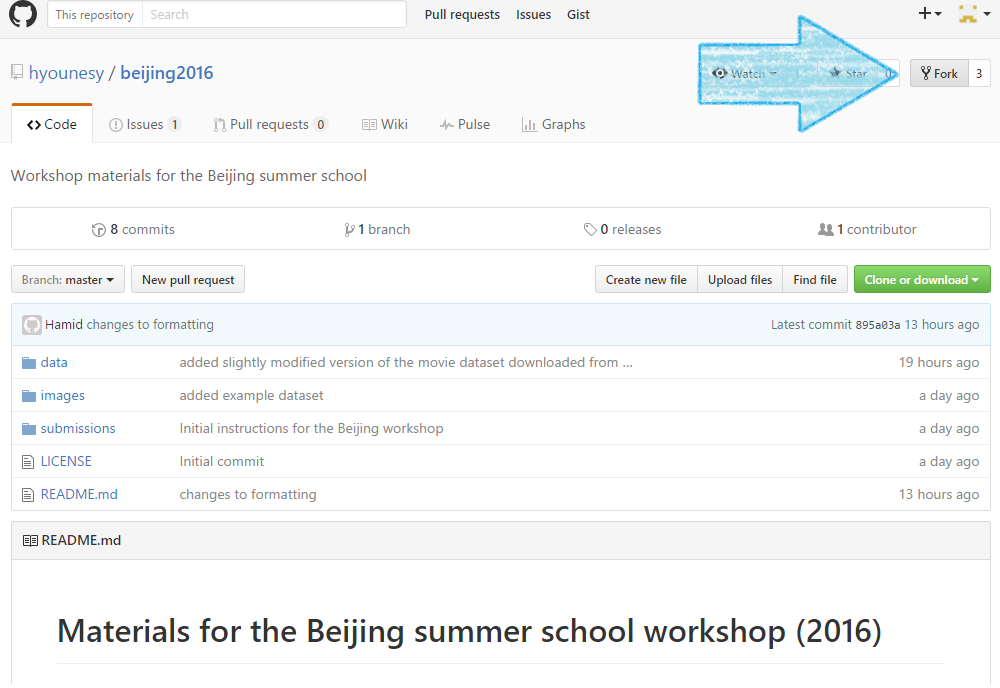
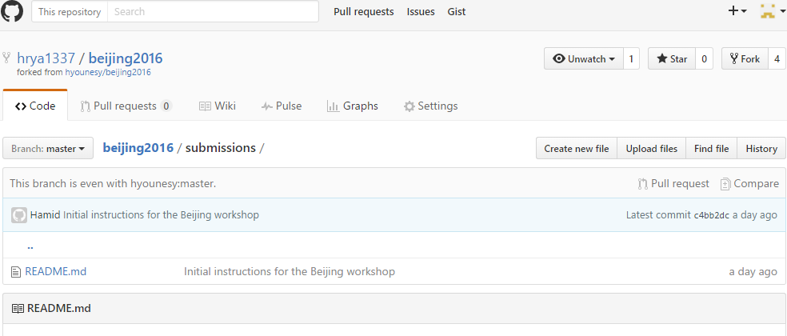
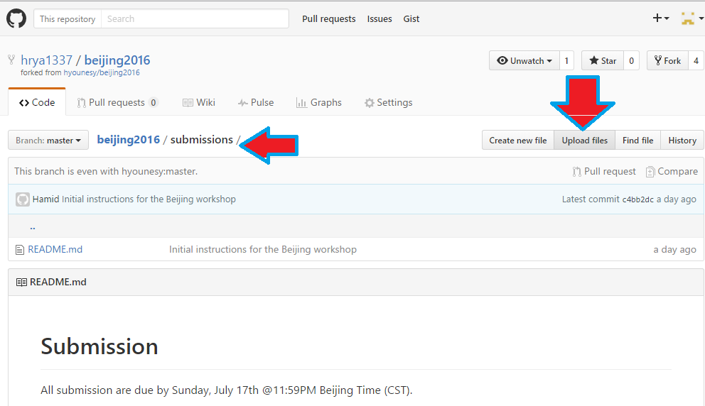
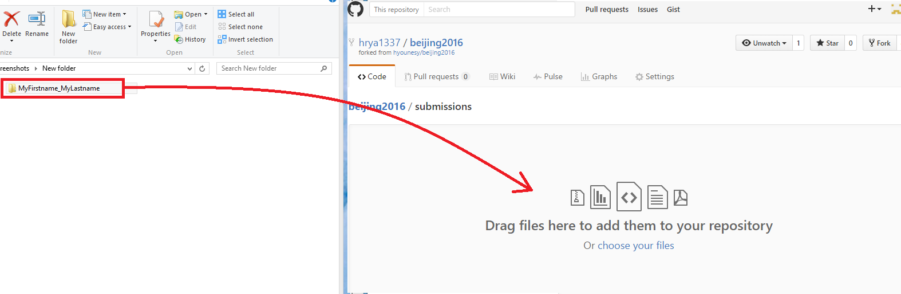
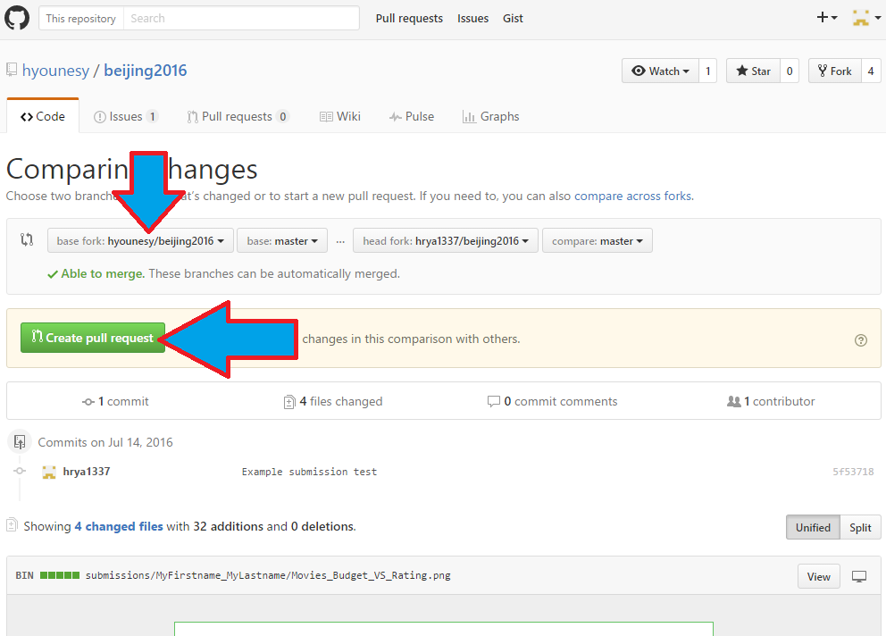

# Submission
All submissions are due by Sunday, July 17th @11:59PM Beijing Time (CST). The results will be announced and discussed during the workshop session on Monday July 18th.

Submission should be in the form of a git pull request of a directory with your fullname (Firstname_Lastname) containing your submissions as well as a ```readme.txt``` (or ```readme.md``` if you would like to use markdown) file, specifying the category(ies) you are submitting for and any additional information about your submission.

## Submission Instructions:
### Option1
If you are already comfortable with git commands, then just create a fork of the project, place your files in a directory named as your fullname (i.e. Firstname_Lastname) inside the submissions directory. Commit and push it (to your forked branch) and then create a pull request. Please put your fullname in the commit and pull request messages.

### Option2
You may also use the github's web interface to upload your submission:

  * Make sure you are logged in with your github account
  * In your browser, navigate to the workshop's [github page](https://github.com/hyounesy/beijing2016/)
  * In the github page, click on [Fork] button on the top right to create a fork of the repository



  * Notice that you will now have a forked branch under your own repository



  * In your computer, place all you submission materials into a directory named with your fullname (Firstname_Lastname)


  * In your github branch, go under the beijing2016/submissions/ directory
  * click on the [Upload files] button



  * drag and drop the directory from your computer into the github upload page. Then add your fullname in the commit message and commit the changes.



  * Go back to the main github repository page (/beijing2016) and click on [New pull request].


  * Make sure base fork is selected as hyounesy/beijing2016. Then Click on [Create pull request] button.



  * You are done. Thanks for your submission!
